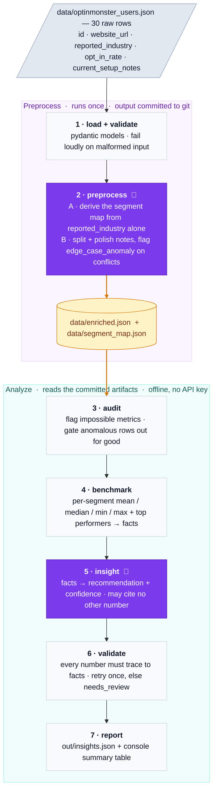

# Smart Insights Agent

A Python CLI over a 30-row mock dataset of [OptinMonster](https://optinmonster.com) customers — one row per customer website, holding a self-reported industry, the opt-in rate of that site's email-capture campaign, and a free-text note describing how the campaign is configured (form factor, trigger, targeting, offer, form fields). The data is deliberately raw: industry labels collide ("eCommerce" / "E-comm" / "Retail / Ecom"), two rates are impossible (105.0, -0.5), and several notes quietly reveal that the rate is measuring nothing at all — a tracking script that never fires, a form with no email field.

The CLI normalizes that data, benchmarks each site against its industry peers, and uses an OpenAI GPT model to produce one validated, plain-English "next-best-action" recommendation per site. Deterministic code owns every statistic and decision; the LLM only reshapes prose it is given — never authoring facts or numbers. The sample is treated as one instance of the input schema rather than a set of constants: see [Built for real data](#built-for-real-data-not-for-the-sample). Full design: [SPEC.md](SPEC.md); AI-collaboration history: [PROMPTS.md](PROMPTS.md).

## Architecture

Seven stages. The LLM appears at exactly two of them; every other stage — and the entire test suite — is deterministic Python that runs offline with no API key.



🤖 marks the two LLM stages; the amber store is the committed artifact both halves pivot on. Anomalous rows — an impossible metric *or* contradictory fields — are gated out at stage 3 with `benchmark = null` and `insight = null`; only **clean** rows (no anomalies) flow on to stages 4–6, and the anomaly text itself is a broken site's answer.

Two ideas carry the design:

1. **Preprocessing is a committed artifact, not a runtime step.** Extraction is non-deterministic; benchmarks must not be. Stage 2 runs once, its output is committed, and everything downstream reads that same frozen input.
2. **Anomalous rows are gated out early and stay out.** A broken site gets a diagnosis, not marketing advice: a dead tracking script means fix the install, not try exit intent.

### The `facts` dict

`facts` is the per-clean-row bundle stage 4 builds and stage 5 hands the model — **the model's entire universe.** It is exactly what the LLM sees, and the sole set of numbers a recommendation is allowed to cite; stage 6 rejects any number in the prose that is not in this bundle. One row's `facts` holds:

- `id`, `website_url`, `canonical_industry_segment` — who this site is;
- `opt_in_rate`, `cleaned_setup_notes` — its own rate and how its campaign is set up;
- `benchmark` — where this site stands against its peers: the segment's mean/median/min/max opt-in rate, plus a `low_confidence` flag that is true when the segment holds too few peers (fewer than `MIN_SEGMENT_SIZE`) to be a trustworthy benchmark, telling the model to hedge rather than lean on it;
- `top_performers` — up to three better-performing peers in the same segment, each with its `opt_in_rate` and `cleaned_setup_notes`: concrete setups doing better, for the model to draw an action from.

Anomalous rows get no `facts` (no benchmark, no insight). Each output row carries its `facts` back, which is what lets `evaluate` re-run the grounding check offline.

## Setup

Dependencies are managed with [uv](https://docs.astral.sh/uv/) and pinned in `uv.lock`. `uv sync` creates `.venv` and installs the project plus the `dev` group; `uv run` re-checks the lockfile before every command, so there is no virtualenv to activate.

```bash
uv sync                    # env + deps from uv.lock
cp .env.example .env       # add OPENAI_API_KEY — only needed for step 4 below
```

## Run

From a fresh clone to `out/insights.json`. Steps 1–3 need no API key, because they read the committed stage-2 artifacts (see below); only step 4 calls the model.

```bash
# 1. Confirm the checkout is sound. All tests run offline, LLM mocked.
uv run pytest

# 2. See the deterministic half of the pipeline: stages 3-4.
uv run python -m smart_insights clean

# 3. Full pipeline with the LLM stubbed out: stages 3-4, then report.
uv run python -m smart_insights run --no-llm

# 4. Full pipeline for real: stages 3-7. Needs OPENAI_API_KEY.
uv run python -m smart_insights run
uv run python -m smart_insights run --id 7        # one row only, cheap debugging

# 5. Re-verify the output offline — the grounding check, without the API.
uv run python -m smart_insights evaluate          # defaults to out/insights.json
```

| Step | Consumes | Produces | API key |
|------|----------|----------|---------|
| 1 `pytest` | `data/enriched.json`, fixtures | pass/fail | no |
| 2 `clean` | `data/enriched.json` | console: segments, anomaly flags, benchmark table | no |
| 3 `run --no-llm` | `data/enriched.json` | `out/insights.json` with `status: llm_skipped`, `insight: null` | no |
| 4 `run` | `data/enriched.json` | `out/insights.json` — one recommendation per clean row | **yes** |
| 5 `evaluate` | `out/insights.json` | per-row pass/fail, exit 0 or 1 | no |

Step 5 is the safety gate: each output row carries the `facts` its recommendation was grounded in, so `evaluate` can re-run every `validate.py` check from the file alone and exit nonzero if any row fails. With no arguments it reads the committed real output (`out/insights.json`), so you can check this repo without a key of your own:

```bash
uv run python -m smart_insights evaluate
```

Stage 2 is deliberately *not* part of that sequence. It is the one command that must hit the API, and it exists to regenerate the committed artifacts — run it only when the input dataset or the stage-2 prompts change:

```bash
uv run python -m smart_insights preprocess   # data/optinmonster_users.json
                                             #   -> data/enriched.json
                                             #   -> data/segment_map.json
```

## CLI options

Every flag has a default that reproduces the runs above, so the commands work with no arguments — the paths below are documented because they are overridable, not because you must set them.

| Command | Flag | Default | What it does |
|---------|------|---------|--------------|
| `preprocess` | `--input` | `data/optinmonster_users.json` | raw 30-row dataset to enrich |
| | `--output` | `data/enriched.json` | where the enriched rows are written |
| `clean` | `--input` | `data/enriched.json` | committed artifact to benchmark |
| `run` | `--input` | `data/enriched.json` | committed artifact to run stages 3–7 over |
| | `--output` | `out/insights.json` | where insights are written (full-run default; `--id` derives its own, below) |
| | `--id N` | all rows | run a single row by `id`; defaults its output to `out/insights.row<ID>.json` so the committed full run is never clobbered — cheap debugging |
| | `--no-llm` | off | stop after stage 4; skip the LLM, emit `insight: null` |
| `evaluate` | `--input` | `out/insights.json` | saved output file to re-verify offline |

`preprocess` also writes `data/segment_map.json` (pass A's segment vocabulary); that path is fixed, not a flag. `--id` and `--no-llm` exist only on `run`.

```bash
# Run one row, offline. --id writes its own out/insights.row7.json, never the committed full run.
uv run python -m smart_insights run --id 7 --no-llm

# Benchmark a different enriched artifact (e.g. a regenerated copy).
uv run python -m smart_insights clean --input data/enriched.json

# Enrich an alternate raw dataset into an alternate artifact.
uv run python -m smart_insights preprocess --input data/optinmonster_users.json --output data/enriched.json
```

## Row status

Every row in `out/insights.json` carries a `status` — how the pipeline *ended* for that row — and a `status_reason`, the failure text when it did not end well (`null` otherwise). Together they are why no run dies on a bad row and no bad row disappears.

| `status` | When | `status_reason` |
|----------|------|-----------------|
| `ok` | clean row with a grounded recommendation — or an anomalous row, gated out | `null` |
| `needs_review` | stage 5 failed twice: an ungrounded number, an unparseable answer, or an API error | the failure |
| `llm_skipped` | `run --no-llm`, so stages 5–6 never ran | `null` |

An anomalous row is `ok`, not a failure: gating it out *is* the right answer, so it lands with `insight: null` and its anomaly field carrying the diagnosis. A `needs_review` row keeps the rejected insight next to the reason it was rejected (`number '105' does not appear in this row's facts`) — the reviewer sees what the model said and why it was thrown out, rather than an absence.

Downstream, `needs_review` rows are excluded from the clean count in the console summary and fail `evaluate`; `llm_skipped` tells `evaluate` that a missing insight was intentional rather than a dropped row.

## Committed artifacts

Three generated files are checked into git rather than produced at runtime. The reason is the same for all three: **the LLM stages are non-deterministic, and nothing downstream of them may be.** Freezing their output makes every later command, and the whole test suite, reproducible and runnable offline — a reviewer with no API key can still exercise the entire pipeline and read real model output.

| Artifact | Written by | What it holds | Why committed |
|----------|-----------|---------------|---------------|
| `data/enriched.json` | `preprocess` (stage 2) | every input row plus `canonical_industry_segment`, `cleaned_setup_notes`, `edge_case_anomaly` | It is the input to stages 3–7 and to every test. Re-deriving it per run would let benchmark numbers shift between runs on identical data. |
| `data/segment_map.json` | `preprocess` (stage 2, pass A) | the derived segment vocabulary + the variant→segment mapping | The model's vocabulary choice is a judgment call; committing it makes it auditable and pins every downstream run to the same segments. |
| `out/insights.json` | `run` (stage 7) | a real full-run output, all 30 rows | Lets a reader see genuine gpt-5 recommendations and run `evaluate` against them without a key. All 30 rows pass. |

`run` writes to `out/insights.json`, and that file is committed as the real reference output. Only that path is tracked; other files under `out/` (e.g. single-row `--output` runs) stay gitignored, so working runs never pollute the diff.

## Trap handling (sample dataset)

| ID | Trap | Handling |
|----|------|----------|
| 8  | `opt_in_rate: 105.0` | `impossible_metric_anomaly: true`; never benchmarked |
| 20 | rate `-0.5` **and** notes describe a dead webhook | both flags: impossible metric + `edge_case_anomaly` (leads vanishing) |
| 4  | rate `0.0`, 0 impressions vs 15k visitors | `edge_case_anomaly`: tracking script not firing |
| 12 | rate `0.02`, no email field at all | `edge_case_anomaly`: rate measures the wrong thing |
| 3  | `reported_industry: SaaS`, notes sell bakeware | segment stays what `reported_industry` implies (normalization never reads other fields); the contradiction is recorded as `edge_case_anomaly` |
| all | "eCommerce" / "E-comm" / "Retail / Ecom" ... | segment set derived from the data by one LLM call, validated in code, committed as `data/segment_map.json` |

Anomaly **classes**, not row IDs, drive the pipeline — the IDs above are just the sample's instances, asserted in tests, never hardcoded in `smart_insights/`.

## Built for real data, not for the sample

The 30 rows are an instance of the input schema, not the scope of the design. Nothing in `smart_insights/` is fitted to them, and the parts that would normally break on unseen data are the parts that were designed hardest:

- **The industry vocabulary is derived, not hardcoded.** A lookup table of spelling variants only ever fits the sample it was written against. Instead one LLM call derives the segment set from the data's own `reported_industry` values, code validates the result, and it is committed (`data/segment_map.json`). New wordings on new data need no code change.
- **Token cost already scales with variety, not volume.** The variants are deduplicated case- and whitespace-insensitively *before* that call (`normalize.py`), so a million rows collapse to a few hundred distinct strings — the derive call costs the same. Only the per-row stage-2 pass grows with row count, which is exactly why it is a one-off committed artifact rather than a runtime step.
- **Small-sample statistics are policed.** Real segments are lumpy, so a non-`other` segment with fewer than `MIN_SEGMENT_SIZE` clean rows is flagged `low_confidence` rather than silently trusted: a mean over two sites is not a peer benchmark.
- **Failure is per-row, never per-batch.** A refusal, a malformed parse, or an ungrounded number retries once and then lands as `needs_review` with a reason. No run dies on one bad row, and no bad row is silently dropped.
- **Customer free text is quoted to the model, never obeyed** — the same framing holds whether the notes come from a mock file or a live CRM export.

Two optimizations are identified and deliberately deferred (SPEC §10), each noted at the code that would change:

| Tweak | Where | Why it waits |
|-------|-------|--------------|
| Chunk the variant list; move the per-row stage-2 and insight calls to the **Batch API** (~50% cheaper, 24h window) | `normalize.py:7`, `benchmark.py:6` | 30 rows run sequentially in seconds; batching buys nothing at this size |
| Summarize each segment's top setups **once** and reference that shared summary, instead of joining the same performers' notes into every peer's prompt | `benchmark.py:6` | Duplication is negligible at 30 rows; it is the dominant prompt cost at scale |

Everything else — persistence, concurrency, auth, a web UI, multi-metric support — is out of scope for a 3–4h prototype by choice, not by oversight.

## Checks

```bash
uv run ruff format                    # format
uv run ruff check --fix               # lint (E, F, I, UP, B, SIM, RUF)
uv run mypy                           # static types, strict over smart_insights/ and tests/
```

## TODO

**Tune the model *and* the reasoning effort per task, not once for the whole app.** Both LLM stages currently share one constant — `MODEL = "gpt-5"` in `smart_insights/__init__.py:18` — and neither passes a `reasoning` parameter, so both also run at the model's default effort. That was a simplicity call: one knob, one swap, the strongest model at its standard setting, so no stage is ever the weak link. It is not good practice. Both are cost levers, and the three calls are not the same kind of work:

| Call | What the model actually does | Cheaper model? | Effort |
|------|------------------------------|----------------|--------|
| 2A — derive the segment map (`preprocess.py`) | one call, real judgment: invent a segment vocabulary from raw industry strings and defend it | No. Runs once, is committed, and every downstream benchmark inherits its choice. Buy the best. | Raise it. This is the one call where thinking longer is worth paying for. |
| 2B — per-row notes + anomaly (`preprocess.py`) | 30 calls: split prose into fields, flag a field that contradicts another | Likely. Mostly extraction — but the anomaly judgment is the subtle part. | Split it. Extraction wants low; deciding "these two fields contradict" does not. |
| 5 — recommendation (`insights.py`) | one call per clean row: reshape a `facts` dict into prose, cite nothing else | Likely. Deterministic code already owns every number; the model is a writer, and `validate.py` catches it if it strays. | Lower it. There is nothing to reason *about*: the arithmetic is done, the facts are handed over, the job is phrasing. |

The API takes effort as `reasoning={"effort": ...}` on the same `responses.parse()` call, ranging from `minimal` (latency-critical, barely any reasoning tokens) through the `medium` default up to `high` (hard reasoning, paid for in tokens and latency) — exact levels vary by model, so check the [reasoning guide](https://developers.openai.com/api/docs/guides/reasoning) against whatever `MODEL` is set to. Reasoning tokens are billed as output tokens, which is also why `MAX_OUTPUT_TOKENS` sits at 8192: they are spent from that same budget.

So the fix is a small per-stage config — model plus effort — and then an evaluation, because neither is a guess worth shipping unmeasured: run the cheaper/lighter setting over the same committed inputs, diff against `out/insights.json`, and keep the downgrade only where quality holds. At 30 rows the saving is pennies, which is why this is written down rather than done.
