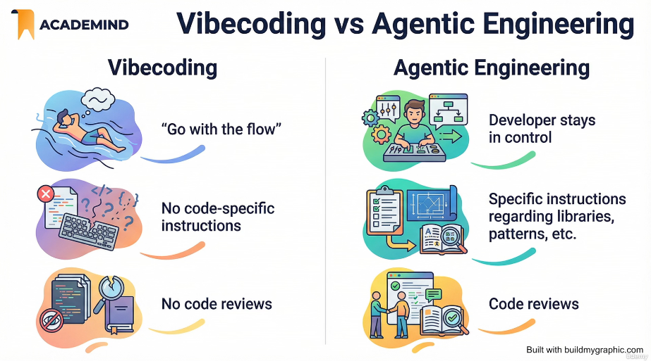

# Developer's Notes: Building the Smart Insights Agent with AI

*These are my personal notes from developing this project. They are not part of the requested deliverables, but I believe they offer useful insight into how the tool was built and how I work.*

## 1. The overfitting trap, and why a human's eyes still matter

I built the architecture and workflow with AI, based on the given assignment brief and the sample data — specifically using Claude Code driven by the Opus 4.8 and Fable 5 models. At first, however, the result was not what I expected. The problem is that the AI knew not only the project spec but also the exact data it would have to handle, so it produced an architecture that fit the sample data *too* well. It already knew the specific edge cases and anomalies in those 30 rows — an impossible `opt_in_rate` of 105.0 or -0.5, a rate of 0.0 alongside 15,000 unique visitors, a "SaaS" industry label on a site whose notes describe selling baking sheets — and it quietly designed around those exact rows, along with the disagreements between `opt_in_rate`, `reported_industry`, and `current_setup_notes`.

You can see how wrong the initial architecture and workflow were by going back through the git commit history to the first version of `SPEC.md`. (`SPEC.md` is the description of what you are building that is fed to the AI: a plain-English contract covering the pipeline, the data schemas, and the commands, which the coding agent then compiles into working code. In this workflow the specification is the real artifact, and the code is a compilation target.) With that first architecture, the AI would have built a tool that overfits the sample data: in other words, the results would be perfect for the given sample, but the tool would produce wrong results on any different data.

I think that is where a human's engineering eyes are necessary. I reviewed the initially generated `SPEC.md` very thoroughly and refined and corrected it by prompting — steering the AI — rather than editing it by hand. That is the first step in agentic engineering: with AI coding agents introduced, we engineers spend more time writing the technical specs and plans than we spend just coding. This project bears that out: of the 38 curated prompts that built it, 23 — sixty percent — landed before a single line of code was generated. (The full analysis of how the agent was steered, prompt by prompt, is in the accompanying [agentic engineering review](../my-ai-log/agentic-engineering-review.md).)

I updated `SPEC.md` by combining different models. In general, I use Opus 4.8 for everyday complex tasks, Fable 5 for the hardest and longest-running tasks, and Haiku for the fastest quick answers — because tokens cost money in the AI world.

## 2. Designed for production scale, not just 30 rows

Although only a 30-row dataset was given for this prototype, I designed and developed the tool with production level in mind, so it can be applied to real-world data that could be millions of rows.

For example, my pitch split the tool into two layers: layer 1, the data layer — group all websites into peer segments by industry, then for each segment compute the average opt-in rate and identify what the top performers have in common — and layer 2, where a scoped LLM turns the facts computed in layer 1 into a friendly, plain-English message. The averaging and counting in layer 1 are ordinary data work: no AI, just grouping and arithmetic.

But the grouping itself turned out to need a scoped LLM too, and this is where the build diverged from the plan. I had pitched layer 1 as pure data work with no AI. In practice, the industry labels are messy free text ("eCommerce", "E-comm", "Retail / Ecom", "SaaS"), and no fixed lookup table can merge wordings it has never seen — and with millions of data rows, building such a lookup table would be impossible anyway. So one LLM call derives the segment set from the data's own industry values, deterministic code validates and applies it, and the result is committed to disk so every later run reads the exact same segments. The LLM only decides which labels mean the same industry; it never touches the numbers. So the honest picture is that AI appears in both layers — cleaning the inputs in layer 1, and wording the recommendation in layer 2 — while deterministic code still owns every statistic.

Traditional cleaning (regex, string operations) can only get you so far. The interesting part is that an LLM is used as a data-normalization engine sitting upstream in the pipeline, turning messy, heterogeneous free-text notes — the kind of thing a support rep types into a CRM — into uniform, information-dense records. The general principle is: cheap and deterministic first, LLM second, and never spend a token on a row you would have dropped.

At production scale, a huge number of synchronous API calls is the wrong shape. Instead, use the provider's batch API — you trade latency (a 24-hour completion window) for a substantial discount. I did not use the batch API in this project, since the data consists of just 30 rows, but considering the real-world case of millions of rows, I documented that use case in `README.md`.

## 3. Edge cases

I encountered three edge cases in the process of developing this tool. There could be more, depending on the angle from which you look at the project.

1. **Fields that disagree.** `reported_industry`, `opt_in_rate`, and `current_setup_notes` can contradict each other: a rate of 0.0 with 15k visitors, a rate with no email field to opt into, an industry label contradicting the notes. These are detectable only by reading prose — so an LLM reads them, and its explanation is recorded as the value of the `edge_case_anomaly` field.

2. **Thin segments.** A peer benchmark averaged over one or two websites is not a real benchmark. The LLM call that derives the segment set is shown how many websites each industry wording covers and is steered to avoid creating segments too thin to benchmark in the first place; where a small segment still occurs — fewer than three clean websites — the benchmark is computed anyway but flagged `low_confidence`, the flag is surfaced in the report, and the recommendation for those rows is never allowed to claim high confidence. There is no invented fallback logic: the tool simply says, honestly, that the comparison rests on thin evidence.

3. **The target row is itself the top performer.** How do you generate an insight for the site that nobody in its segment beats? The insight prompt handles this as an explicit case: when the list of better-performing peers is empty, the model states that the site leads its segment and shifts from "imitate the top performers" to "protect and probe" — keep the winning setup and A/B test exactly one variation of it, grounded in the site's own setup notes. And when the site is the *only* one in its segment, the tool says plainly that there are no comparable sites yet — no congratulations for leading a field of one — and recommends the one A/B test its own setup most invites.

## 4. Reading the git history

- `82e3dbf` → `a5142c0`: Claude Code setup — the `.claude` directory contents and `.mcp.json`
- `d3641fc` → `b85a70c`: `SPEC.md` write-up and tuning
- `88b4df4` onward: building and polishing

## 5. Honest reflections

To be honest, I think this project took me a bit more time to complete than expected. I could have built a quick version without considering production standards and potential scalability, but I believe it is more important to do it right than to do it quickly, and I wanted to show, throughout the development of this project, that I am a detail-oriented software developer with a production mindset.

Professionally speaking, I should have developed this tool only after diving deep into OptinMonster's operations first. But since the given data was small and compact enough, and the project description was clear, I proceeded on that basis.

## 6. How I develop in the current AI era

I do not start vibecoding right after receiving project specs and requirements. I first do a lot of research — paperwork, if you like — on the given project, checking its specs and requirements in detail, and on top of that I decide the direction of the project. Architecture and workflow come before vibecoding.

After every vibecoding session, I manually review and evaluate the generated code, and refine and re-craft it, because AI can hallucinate facts, make logical errors, introduce security vulnerabilities, and often produce output that would not pass a basic code review, let alone be suitable for production. So, for AI-generated code, I try to understand the syntax, recognize potential bugs, identify performance bottlenecks, and ensure adherence to coding standards.

These days, AI replaces much of human work, including software engineering. AI tools can produce code faster than most humans, tackle repetitive tasks with ease, and even suggest solutions to tricky problems. But they do not understand the *why* behind your project; they just execute instructions. Essentially, AI coding assistants amplify your existing abilities: they are powerful force multipliers, not replacements for fundamental knowledge. They excel at automating tedious work, but they do not replace the need for critical thinking and design expertise.

My main coding agent is Claude Code, but I do not use it casually. I learned tips and tricks for leveraging Claude Code effectively from [Claude Code – The Practical Guide](https://github.com/anton-karlovskiy/anton-karlovskiy/blob/main/certificates/Udemy%20certificates/UC-49fa0206-f1c4-46a3-ae59-281af386ed26%20(Claude%20Code%20-%20The%20Practical%20Guide).pdf) and applied the best practices I gained to this project too.

So what I do is not vibecoding — it is agentic engineering.

